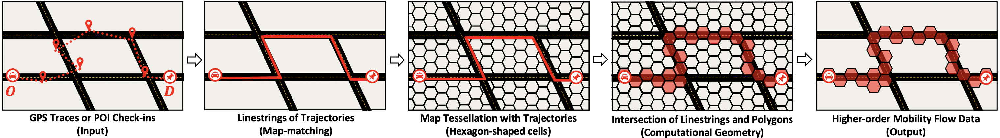

# Point To Hexagon
This is an implementation of how to convert trajecotry datasets to a higher-order trajectory datasets.
We provide the code and datasets used in our paper: [Point2Hex: Higher-order Mobility Flow Data and Resources](link).


## Table of Contents
- [Point To Hexagon](#point-to-hexagon)
  - [Table of Contents](#table-of-contents)
  - [Description](#description)
  - [Dependencies](#dependencies)
    - [Routing Engine](#routing-engine)
    - [Tesselation Engine](#tesselation-engine)
    - [Python Dependencies](#python-dependencies)
  - [Convert Check-ins to Route Points](#convert-check-ins-to-route-points)
    - [Data format](#data-format)
    - [Command Arguments for Converting Check-in Data to Trajectory Points](#command-arguments-for-converting-check-in-data-to-trajectory-points)
    - [Map-matching](#map-matching)
    - [Using Other Routing Engines](#using-other-routing-engines)
  - [Convert Route Points to Hexagon Sequences](#convert-route-points-to-hexagon-sequences)
    - [Data format](#data-format-1)
    - [Command Arguments for Converting Route Points to Hexagon Sequences](#command-arguments-for-converting-route-points-to-hexagon-sequences)
    - [Map-matching](#map-matching-1)
  - [Visulization](#visulization)
  - [Published Datasets](#published-datasets)
  - [License](#license)
  - [Contact](#contact)
  - [Acknowledgments](#acknowledgments)
  - [Citation](#citation)


## Description
This repository contains a pipelie to to convert datasets from check-ins to hexagon sequences.

We usually have two types of trajectory datasets: check-ins and gps traces.

The check-in dataset is a sequence of check-ins, each of which is a pair of location as source and destination.
This type of dataset can be gathered from social media platforms or any platforms that allow users to input check-ins, or some organizations that collect check-ins from users.
For example check-ins in the taxi dataset are collected from taxi companies (we just have the source location and the destination location.)

Also we could have gps traces, which is a sequence of gps points. This GPS traces can be collected from GPS devices or mobile phones.
For example, the GPS traces in the taxi dataset are collected from GPS devices installed in taxis.
Or we can collect GPS traces from mobile phones, which is more common nowadays.
GPS traces are more accurate than check-ins, however, they are more difficult to collect and process, also the due to error in loacating the GPS points, the GPS traces are usually noisy and need to be cleaned and map-matched.

The following diagram shows the general pipeline of converting datasets to higher-order trajectory datasets.




## Dependencies

### Routing Engine
We are using OSRM as the routing engine and map-matching engine.

Here is a link to learn how to install and run OSRM.
[How to setup OSRM usgin Docker](https://github.com/Project-OSRM/osrm-backend#using-docker)

### Tesselation Engine
Also we are using H3 as the hexagon tesselation engine.


### Python Dependencies
For the python code you can install the dependencies by running:
```sh
pip install -r requirements.txt
```


## Convert Check-ins to Route Points

To convert check-ins to route points, we need to use a routing engine to generate the route points between the source and destination of each check-in.
Make sure you have the information of the routing engine you are using, such as the host and port of the routing engine.

### Data format
The input data should be a csv file and, have the following columns:

```
start_point_lon, start_point_lat, end_point_lon, end_point_lat
```


### Command Arguments for Converting Check-in Data to Trajectory Points

The `loc2point_run.py` script accepts command-line arguments for converting check-in data to trajectory points. Below is a description of each argument:

- `input_file` (positional argument): The path to the input file containing the check-in data.

Optional arguments:

- `-o, --output`: The path to the output file. If not specified, the default value is `output.csv`.

- `-slon, --start-column-longitude`: The column name for the longitude of the start point. Default value: `start_point_lon`.

- `-slat, --start-column-latitude`: The column name for the latitude of the start point. Default value: `start_point_lat`.

- `-elon, --end-column-longitude`: The column name for the longitude of the end point. Default value: `end_point_lon`.

- `-elat, --end-column-latitude`: The column name for the latitude of the end point. Default value: `end_point_lat`.

- `-or, --output-route`: The column name for the route in the output file. Default value: `route_points`.

- `-u, --base-url`: The base URL of the routing service (specifically OSRM). Default value: `http://127.0.0.1:5000`.

- `-t, --threads`: The number of threads to use for processing. Default value: `70`.

- `-s, --split`: Flag to indicate whether to save the output of each thread separately.  If the split option is enabled, the output file will be multiple csv files (one for each thread.) Default value: `False`.

To run the script with the desired arguments, use the following command:

```
python loc2point_run.py [input_file] [-o OUTPUT] [-slon START_COLUMN_LONGITUDE] [-slat START_COLUMN_LATITUDE]
               [-elon END_COLUMN_LONGITUDE] [-elat END_COLUMN_LATITUDE] [-or OUTPUT_ROUTE] [-u BASE_URL]
               [-t THREADS] [-s]
```

Make sure to replace `[input_file]` with the actual path to the input file.

Note: The default values mentioned above are used when the corresponding argument is not provided.


### Map-matching
As we use OSRM to generate the route points, we do not need map matching for check-ins because we already have map-matched points for our trajectories.

### Using Other Routing Engines
Our implementation is compatible with other routing engines, you just need to implement the routing engine api like `lib/api/OpenSteetMap.py` file and change the api class in `loc2point_run.py` to your routing engine api class.

## Convert Route Points to Hexagon Sequences

### Data format
The input data should be a csv file and, have the following columns:

which the route points are in the following format:
```sh
[(long, lag), (long, lag), ... (long, lag)]
```


### Command Arguments for Converting Route Points to Hexagon Sequences
For route points file from last step:
```sh
python preprocess/preprocess.py --res 9 --data data/Archive/ --save nycTaxi
```
For GPS-based trajectory dataset file:
```sh
python preprocess/porto.py --res 9
```
Alternatively, run the bash script in which you can define your job 
```sh
bash job.sh
```

### Map-matching

For map-mathching of the route points, we use OSRM to map-match the route points to the road network.
You can run the `maching_run.py` script to map-match the route points.

The `matching_run.py` script is designed to match route points on a map using a Map Matching Service. It utilizes threading to improve performance by processing multiple routes simultaneously. The script takes command-line arguments to specify input and output files, column names, base URL of the Map Matching Service, and the number of threads to use for parallel processing.

**Usage:**
```
python matching_run.py [input_file] [-o OUTPUT] [-c COLUMN] [-u BASE_URL] [-t THREADS]
```

**Arguments:**
- `input_file`: Path to the input file containing route data.
- `-o, --output OUTPUT`: Path to the output file where the matched route data will be saved. (Default: 'output.csv')
- `-c, --column COLUMN`: The name of the column in the input file that contains the route points. (Default: 'route_points')
- `-u, --base-url BASE_URL`: The base URL of the Map Matching Service. (Default: 'http://127.0.0.1:5000')
- `-t, --threads THREADS`: The number of threads to use for parallel processing. (Default: 70)

**Script Overview:**
1. Parse the command-line arguments.
1. Define the `MatchRoutePointsThread` class, which represents a thread responsible for matching route points.
1. Initialize the Map Matching Service API and the logger.
1. Load the input data file specified by `input_file`.
1. Split the data points into multiple segments based on the number 1f threads.
1. Create threads for each segment of data.
1. Start the threads to initiate the map matching process.
1. Wait for all threads to finish their execution.
1. Save the output data to the specified output file.
1. Display a completion message.

**Thread Execution:**
The script uses threading to process route points in parallel. Each thread represents a segment of the data and is responsible for matching the route points within that segment. The threads operate as follows:
1. Each thread retrieves a segment of route points from the input data.
1. If the number of route points is less than 2, a warning is logged, and the thread skips to the next segment.
1. The thread sends a request to the Map Matching Service API with the original route points.
1. If the response is successful, the matched route points are obtained from the response and updated in the data.
1. If the response is not successful, an error is logged, and the thread skips to the next segment.
1. Once all threads have finished executing, the output data is saved to the specified output file.

Note: The script assumes that the `lib.Utils` module and the `lib.api.OpenStreetMap` module are available and contain the required functions and classes.

**One Example Of Map-Matching On The City Map**

Here is one example of running the map-matching on the porto dataset:


Noisy GPS Trace             |  Map-Matched GPS Trace
:-------------------------:|:-------------------------:
  |  


## Visulization


## Published Datasets 
Due to the storage limit, you can find more datasets on [Zenodo](https://doi.org/10.5281/zenodo.7879595). 


## License
Distributed under the MIT License. See `LICENSE.txt` for more information.


## Contact

Ali Faraji - email@faraji@yorku.ca

Jing Li - email@jliellen@yorku.ca

Project Link: [https://github.com/alifa98/point2hex](https://github.com/alifa98/point2hex)


<!--## Acknowledgments
* []()
* []()
* []()
-->

## Citation

If you like our work and/or use the code/datasets we provide, please consider citing our work as:

Faraji, Ali, Li, Jing, Alix, Gian, Alsaeed, Mahmoud, Yanin, Nina, Nadiri, Amirhossein, & Papagelis, Manos. (2023). Higher-order Mobility Flow Data (1.0.0) [Data set]. Zenodo. https://doi.org/10.5281/zenodo.7879595

Alternatively, you can use the following BibTeX formatting:

```tex
@dataset{faraji_ali_2023_7879595,
  author       = {Faraji, Ali and
                  Li, Jing and
                  Alix, Gian and
                  Alsaeed, Mahmoud and
                  Yanin, Nina and
                  Nadiri, Amirhossein and
                  Papagelis, Manos},
  title        = {Higher-order Mobility Flow Data},
  month        = jun,
  year         = 2023,
  note         = {{Github repository: 
                   https://github.com/alifa98/point2hex}},
  publisher    = {Zenodo},
  version      = {1.0.0},
  doi          = {10.5281/zenodo.7879595},
  url          = {https://doi.org/10.5281/zenodo.7879595}
}
```
